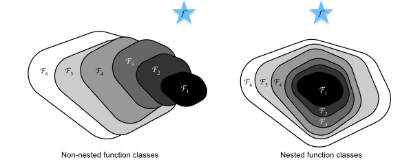
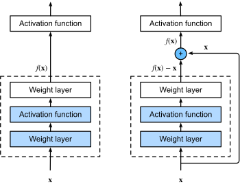
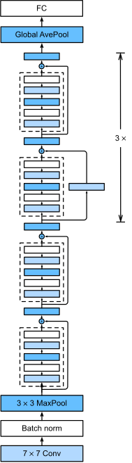

## ResNet

### Function Class

ref https://classic.d2l.ai/chapter_convolutional-modern/resnet.html

Fig. 1 Non-nested function classes vs Nested functinal classes 

For non-nested function classes, a larger function class doesn't guaratee to get closer to the "truth" function ($f^*$ in the above figure). It guarates in the nested function classes. 

At the heart of the proposed residual network (ResNet) is the idea that every additional layer should more easily contain the identity function as one of its elements.

### Residual Blocks

ref https://classic.d2l.ai/chapter_convolutional-modern/resnet.html

Fig. 2 A regular block (left) and a residual block (right)

Assume the desired underlying mapping we want to obtain is by learning $f(x)$ . On the left of the above figure, the mapping $f(x)$ is learned directly within the dotted-line box. While on the right, the residual mapping $ f(x) - x$ is learned within the dotted-line box.

### ResNet Architecture

Fig.3 The ResNet-18 architecture