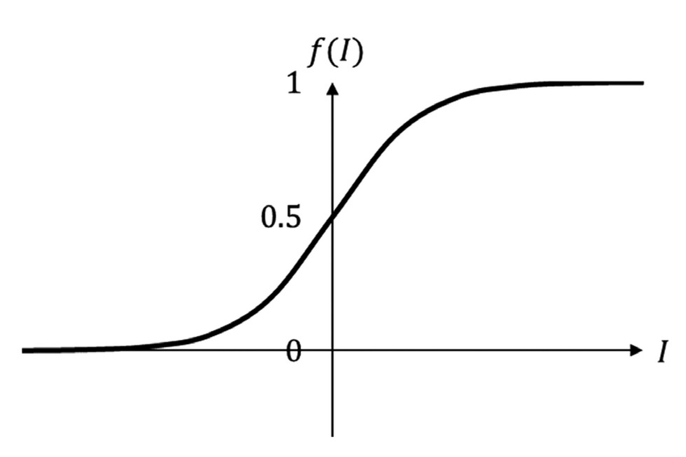
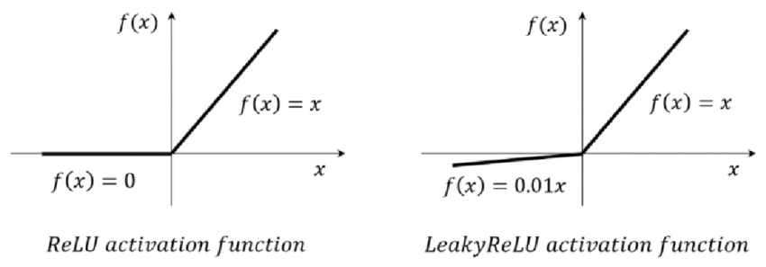

## Activation Functions

### Sigmoid Function 

(ChatGPT)

The sigmoid function, also known as logistic function is a commonly used activation function particulary in binary classification problems.

$$f(z) = \frac{e_z}{1+e_z}$$

https://www.researchgate.net/figure/Standard-sigmoid-function_fig2_336275807

1. Map any real value into [0, 1], which can be interpreted as the probability of the input.

2. Smoothness and differentiability, which is important for gradient-based optimizer.

3. Non-linear Transformation: Introduce non-linearity to the model, allowing it to learn complex decision boundaries and capture non-linear relationships between input and the target variable.

4. Output Interpretability

### Softmax Function

([Wiki](https://en.wikipedia.org/wiki/Softmax_function) and ChatGPT)

The softmax function converts a vector of $K$ real number into a probability distribution of $K$ possible outcomes. It is a generalization of the logistic function to multiple dimensions, and used in multinomial logistic regression. The softmax function is often used as the last activation function of a neural network to normalize the output to a probability distribution over predicted output classes. 

$$ p_i = \frac{e^{z_i}}{\sum_j^K e^{z_j}}$$

The softmax function tends to amplify the differences between input values, meaning that it assigns higher probabilities to the class with the highest input value and relatively lower probabilities to the other classes. This characteristic makes softmax suitable for multi-class classification tasks, where each input belong to exactly one class.

### ReLU 

ReLU stands for rectified linear unit.

$$ReLU(x) = max(0, x)$$

The desirable properties of ReLU:

1. Non-linearity

2. Sparse Activation: ReLU can lead to sparse activations because it set the negative values as zero. This sparsity can be benefical for reducing computational complexity and overfitting, as only a subset of the neurons is activated for each input. 

3. Efficient Computations: as it involves a simple comparison and selection operations.

Limitations of ReLU:

1. Dead Neurons: ReLU neurons can sometimes become "dead" during training, where they always output zeros. Once a neuron becomes zero, it cannot recover and update its weights through gradient descent. This issue is more prevalent when using a large learning rate or during the initialization phase.

2. Unbounded Output: ReLU does not have a upper bound, which can lead to exploding gradient during training. Using Leaky ReLU or Parametric ReLU.

3. Not suitable for negative inputs: can not capture the negative part of the data distribution. Using Leaky ReLU or Parametric ReLU.

### Leaky ReLU

$$LeakyReLU(x) = max(ax, x)$$

$a$ is a small constant (typically a small positive value like 0.01). Thus, it set the negative input to a small non-zero value.

LeakyReLu offers several benefits:

1. Avoid dead neurons.

2. Sparse Activations

3. Continuity

https://www.researchgate.net/figure/ReLU-activation-function-vs-LeakyReLU-activation-function_fig2_358306930

### Tanh

Tanh short for Hyperbolic Tangent

$$tanh(x) = \frac{e^x - e^{-x}}{e^x + e^{-x}}$$

https://mathworld.wolfram.com/HyperbolicTangent.html
