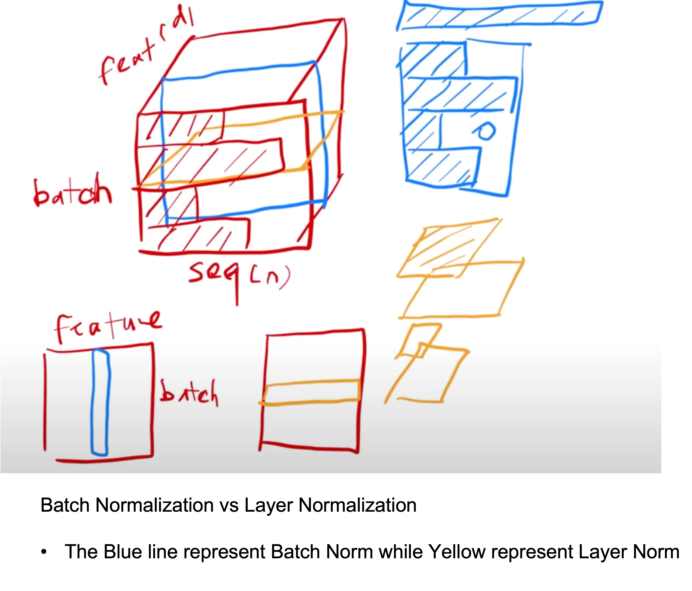

## Attention Mechanism

reference to https://www.youtube.com/watch?v=XhWdv7ghmQQ

Using simpleRNN to descibe the ideas of attention and self-attetion mechanism. 

Attention mechanism is to focus the attention to specific parts of data through adding a layer of neural network.

* SimpleRNN + Attention

Attention Weight: $\alpha_i = align(h_i, s_0)$  is to measure the relationship between the hidden state $h_i$ and the encoded vector $s_0$

 

* Methods to obtain attention weights

1. Used in orginal paper which proposed attention mechanism.

 

$\bf v$ and $W$ are trainable.

2. Used in Transformer

 

$W_K$ and $W_Q$ are trainable.

## Self Attention Mechanism

The importance or relevance of each element is calcualted with respected to all other elements within the same sequence.

 

### Transformer 
(learn from https://www.youtube.com/watch?v=nzqlFIcCSWQ and 

Vaswani, Ashish, et al. "Attention is all you need." Advances in neural information processing systems 30 (2017).)

* Encoder 

The encoder is composed of a stack of $N = 6$ identical layers. Each layer has two sub-layers (Multi-head attetion, and MLP). The output of each sub-layer is $LayerNorm(x + sublayer(x))$

ref: https://www.youtube.com/watch?v=nzqlFIcCSWQ&t=1137s

* Decoder
Also a stack of $N = 6$ identical layers. Each layer has three sub-layers (Masked Multi-head attention, Multi-head attetion, and MLP). 

* Attention / Multi-head Attention

An attention function can be described as mapping a query and a set of key-value pairs to an output where the query, keys, values and outputs are all vectors. (from the paper)

