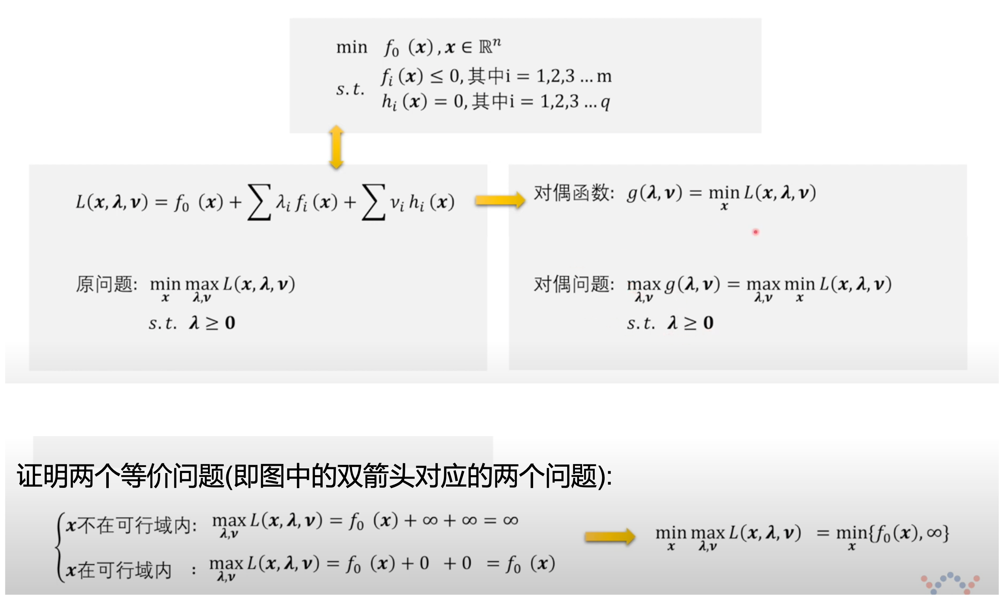

### Method of Lagrange Multiplier

(ChatGPT and Wiki)

In mathematical optimization, the **method of Lagrange Multipliers** is a strategy for finding the local maxima and minima for a function subject to equation constraints.

$$
    min \ f(\mathbf x), x \in \mathbb{R}^n \\
    s.t. \ g_i(\mathbf x) \leq 0, \ i = 1, 2, ..., m \\
         \ h_i(\mathbf x) = 0, \ i = 1, 2, ..., q
$$

===>

$$
    L(\mathbf x, \mathbf \lambda,  \mathbf \nu) 
    = f(\mathbf x) 
    + \sum_i^m \  \lambda_i g_i(\mathbf x) 
    + \sum_i^q \ \nu_i h_i(\mathbf x), 
    \  \lambda_i \geq 0 
$$

* $L(\mathbf x, \mathbf \lambda , \mathbf \nu)$ is Lagrange function
* $\mathbf \lambda_i$ and $\mathbf \nu_i$ are Lagrange multipliers

ref https://www.youtube.com/watch?v=ZX_baiqXhoE&t=La

### Dual Problem

(王木头讲科学, ChatGPT & Wiki)

ref https://www.youtube.com/watch?v=ZX_baiqXhoE&t=La

* The dual problem is always a convex optimization problem no matter what is the prime problem. (by 王木头学科学)

* Strong duality refers to a situation in which the optimal values of the primal problem and its associated dual problem are equal.

### KKT Conditions
(王木头讲科学, ChatGPT and Wiki)

The KKT conditions are a set of **necessary** conditions that must be satisfied for a point to be optimal in a constrained optimization problem.

* Stationarity condition
* Pimal and dual feasibility conditions
* Complementary slackness condition

ref https://www.youtube.com/watch?v=ZX_baiqXhoE&t=La

### Convex Optimization

(Wiki, ChatGPT and 王木头学科学)

Convex optimization studies the problem of minimizing convex functions over convex sets.

* Convex Set

$\forall x_1, x_2 \in C,  0\le \theta \le 1, \theta x_1 + (1-\theta) x_2 \in C$ , then $C$ is convex set

ref https://www.youtube.com/watch?v=ZX_baiqXhoE&t=La

* Convex Function

