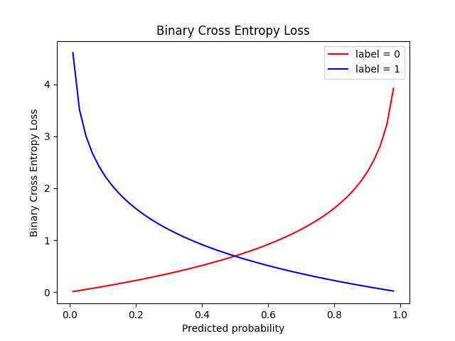

## Loss Function

### Mean Squared Error (MSE)

MSE (mean squared error) is a commonly used loss fucntion in regression problems. 

$$ MSE = \frac{1}{n}\sum_i(y - \hat y)^2$$

where $y$ represents the true or target variables, and $\hat y$ represents the predicted values.

### Cross Entropy

Cross entropy loss, also known as log loss or negative log-likelihood loss, is a commonly used loss function in classification problems.
    
* Binary Cross Entropy Loss

Binary cross entropy loss $ = -(ylog {\hat p} + (1-y)log(1-\hat p))$

where $y$ represents the actual label, and $p$ is the predicted probability of label 1. 

* Categorical Cross Entropy Loss

Categorical cross entropy loss, also known as softmax loss or multi-class log loss, is commonly in multi-class classification problems.

Categorical Cross Entropy loss $ = -\sum_i y_ilogp_i$

where $y_i$ represents the true class labels in one-hot encoded format, and $p_i$ is the predicted class probabilities.

* Sparse Categorical Cross Entropy Loss

The formula is the same as that for categorical cross entropy loss, but it takes into account the integer-encoded class labels instead of one-hot encoded labels.

### Hinge Loss

Hinge loss, also known as max-margin loss, is a loss function commonly used in support vector machine (SVM).

Hinge Loss = $max(0, 1- y * \hat y)$

where $y$ represents the true class label (+1 or -1), and $\hat y$ represent the predicted class labels or scores.

Hinge loss penalizes the model when the predicted score and the true label have opposite signs and are not separated by a margin of at least 1.

